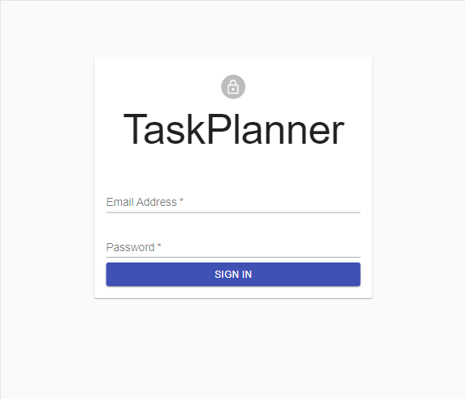

[](https://dashboard.heroku.com/apps) [](https://sheltered-retreat-04173.herokuapp.com) Aplicación desplegada en heroku

1. Create a new React JS project.

    ```javascript
    npx create-react-app task-planner-app
    ```
2. Create the Login.js component and the CSS if needed (use Material-UI library!)



3. Create a navigation drawer component with mocked user data (https://material-ui.com/demos/drawers/)


4. Create the main view that display the tasks using card layouts (https://material-ui.com/demos/cards/). 
    This will be your model to represent a task:
  ```javascript
       {
    	"description": "some description text ",
    	"responsible": {
    		"name": "Santiago Carrillo",
    		"email": "sancarbar@gmail"
    	},
    	"status": "ready",
    	"dueDate": 156464645646
    }
```


5. Learn about service workers and offline support: https://codelabs.developers.google.com/codelabs/offline/#0

6. Use what you just learned to make your App work offline.

7. Deploy your App to Heroku (https://dev.to/smithmanny/deploy-your-react-app-to-heroku-2b6f)

8. Deploy your App as an Azure Webapp (https://devblogs.microsoft.com/premier-developer/deploying-react-apps-to-azure-with-azure-devops/)

9. Submit your github repo along with the heroku and azure url of your solution!
